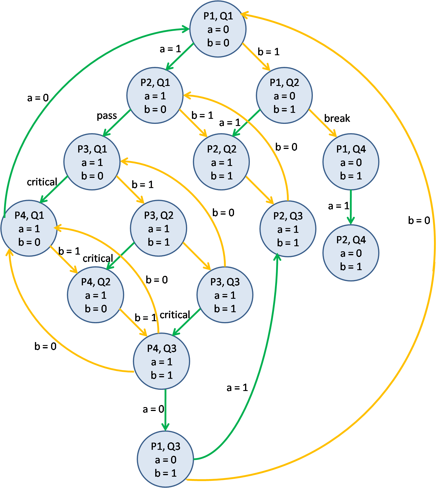

# mpp

#### 1. Диаграмма исполнения в модели чередования операций

 

#### 2. Получилось 14 различных состояний

#### 3. Поток **P** не может находиться в состоянии *P3* (critical section) в то время, как поток **Q** находится в состоянии *Q4*

Если поток **P** находится в состоянии *P3*, то *a = 1*, так как переменная *a* меняется только в потоке **P**. Но тогда поток **Q** не может перейти в состояние *Q4*.

Если поток **Q** находится в состоянии *Q4*, то *b = 1*, так как переменная *b* меняется только в потоке **Q**. Но тогда поток **P** не может перейти в состояние *P3*.

#### 4. Состояние *Q4* достижимо из всех состояний системы, которые возникают во время работы программы 

Для перехода в состояние *Q4* необходимо условие *a = 0*. Если в каком-то состоянии *a = 1*, то всегда существует последовательность переходов, которая приводит к состоянию *Q2* и условию *a = 0*.
